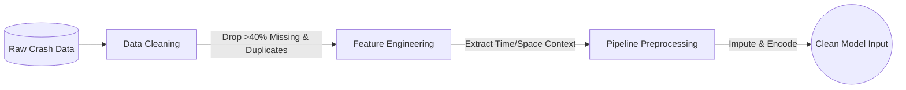
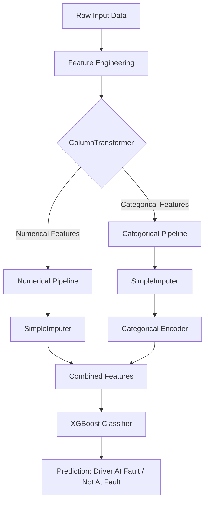

# 🚗 Driver Fault Classification System

An optimized, premium Machine Learning web application designed to instantly classify driver responsibility (At Fault vs. Not At Fault) in motor vehicle accidents. The system uses a gradient-boosting model pipeline trained on historical crash data and serves predictions via an interactive, high-visibility Streamlit user interface.

---

## 🎯 Project Objective (Interview Context)

**The Problem:** Insurance companies and traffic authorities spend significant manual effort determining who is at fault in a collision based on police reports. 
**The Solution:** An automated predictive system that ingest crash conditions (weather, location, vehicle type, driver state) and outputs a highly confident classification of fault. 
**Business Value:** Speeds up insurance claim processing, reduces human bias in fault assignment, and helps identify high-risk driving conditions.

---

## ✨ Features

* **🌞 Permanent Light Mode Theme**: Locked to a clean, modern, and accessible light theme with customized, high-contrast inputs and widgets (fully ignoring device/browser dark mode settings).
* **📝 Single Prediction Form**: An intuitive, step-by-step layout grouped into logical categories:
  * **🚘 Vehicle Information** (Make, Model, Year, Body Type, Movement, Speed Limit)
  * **⚠️ Crash Conditions** (Collision Type, Weather, Surface, Light, Traffic Control)
  * **👤 Driver Details** (Substance Abuse, Injury Severity, Parked status)
  * **📍 Location Coordinates & Route Type**
  * **📅 Crash Timestamp Details** (Hour, Day, Month, Year)
* **📁 Batch Prediction Mode**:
  * **📥 Sample CSV Template Download**: Instantly download a clean template (`sample_accident_template.csv`) with the exact headers and layout matching the model's schema.
  * **📤 Upload & Bulk Predict**: Drop your filled CSV file, instantly preview the uploaded data, and run batch predictions with confidence levels across all records.
  * **💾 Download Predicted Output**: Download the full predicted results file containing classification outcomes (`Driver At Fault` vs. `Driver Not At Fault`) and confidence metrics.
* **🔤 Organized Fields**: Automatically sorts all categorical selections alphabetically within dropdown menus to make options easy to find.
* **⚡ Smart Feature Engineering**: Automatically extracts datetime components (`Is Weekend`, `Night Driving`, `Rush Hour`, `Crash Day of Week`) and spatial locations (`Location X`, `Location Y`) behind the scenes.

---

## 📊 Exploratory Data Analysis (EDA)

*Interview Talking Point: "Before modeling, I needed to ensure data integrity and understand the baseline distributions to guide my feature engineering."*

Our EDA process involved a comprehensive analysis of the historical crash dataset to ensure high data quality and identify key patterns:
* **Missing Value Analysis**: Identified and handled columns with >40% missing values.
* **Cardinality & Uniqueness**: Evaluated categorical columns for cardinality and removed high-cardinality ID columns that do not contribute to predictive power.
* **Data Cleaning**: Detected and removed duplicate records and dropped irrelevant features to streamline the dataset.
* **Distribution Checks**: Summarized column statistics to understand the spread and variations in numerical and categorical features.

---

## ⚙️ Data Engineering & Feature Extraction (DA)

*Interview Talking Point: "Raw data rarely tells the whole story. I engineered temporal and contextual features because human behavior (like driving at night or in rush hour) heavily influences accident liability."*

To maximize the model's predictive capability, we engineered several new features from the raw data:
* **Temporal Features**: Deconstructed `Crash Date/Time` into `Crash Year`, `Month`, `Day`, `Hour`, and `DayOfWeek`.
* **Behavioral/Contextual Indicators**: 
  * `Is Weekend`: Flags accidents occurring on weekends.
  * `Night Driving`: Identifies crashes happening during night hours (before 6 AM or after 6 PM).
  * `Rush Hour`: Flags incidents during peak traffic windows (6-9 AM and 3-6 PM).
* **Spatial Features**: Parsed raw `Location` strings into distinct `Location_X` and `Location_Y` coordinate points for spatial modeling.

### 🔄 End-to-End Data Lifecycle



---

## 🧠 Model & Pipeline Architecture

*Interview Talking Point: "I used a Scikit-Learn Pipeline to prevent data leakage between train and test sets, and chose XGBoost because of its superior handling of non-linear relationships and faster training time compared to CatBoost."*

The system uses a robust, automated Scikit-Learn `Pipeline` combined with a `ColumnTransformer` to handle preprocessing and predictions seamlessly. 



* **Preprocessing Pipeline**: 
  * **Numerical Pipeline**: Applies `SimpleImputer` to handle missing numeric values.
  * **Categorical Pipeline**: Imputes missing categorical values and encodes them for the model.
* **Model Selection & Tuning**: 
  * Evaluated multiple algorithms including *Logistic Regression, Random Forest, Extra Trees, CatBoost, and XGBoost*.
  * **Final Selection**: **XGBoost Classifier** was chosen for the final model due to its optimal balance of high accuracy and faster hyperparameter optimization (tuned using randomized search over `randint` and `uniform` distributions).
* **Deployment**: The entire pipeline (preprocessor + XGBoost model) is serialized via `joblib` into a single `best_model.pkl` artifact, ensuring that production data goes through the exact same transformations as the training data.

---

## 📈 Model Evaluation & Output

During the evaluation phase, the model's performance was assessed using standard classification metrics:
* **Accuracy & Classification Report**: Measured the overall correctness of the model.
* **Predictive Probabilities**: The Streamlit application doesn't just output a binary classification; it utilizes `model.predict_proba()` to output a **Confidence Score** (e.g., 94.2% confident).
* **Why Confidence Matters**: In a real-world business scenario (like Insurance), borderline cases (e.g., 51% confidence) can be flagged for manual human review, while high-confidence predictions (e.g., >90%) can be fully automated, saving immense operational costs.

---

## 🛠️ Tech Stack

* **Frontend Framework**: Streamlit (Python-based interactive application framework)
* **Model Engine**: XGBoost / Gradient-Boosting Pipeline (loaded via Joblib)
* **Data Processing**: Pandas, NumPy, SciPy
* **Machine Learning**: Scikit-Learn (Imputers & Preprocessors)

---

## 📁 Directory Structure

```
Driver_Fault_Predicition/
├── .streamlit/
│   └── config.toml          # Enforces light theme styling options globally
├── data/
│   ├── test_accident.csv    # Evaluation data
│   └── train_accident.csv   # Training dataset
├── model/
│   └── best_model.pkl       # Trained gradient-boosting model pipeline
├── notebooks/
│   └── Driver_Fault_Classification.ipynb  # Model training & notebook research
├── app.py                   # Main Streamlit web application
├── sample_mixed.csv         # Raw batch sample template source
└── requirements.txt         # Project dependencies
```

---

## 📋 Input Data Schema (for Batch CSV Uploads)

To process files in batch prediction, your CSV should follow the standard column labels. The template contains fields such as:

| Column Name | Description / Example |
| :--- | :--- |
| `Vehicle Year` | Production year of the vehicle (e.g., `2018`) |
| `Speed Limit` | Roadway speed limit in MPH (e.g., `35`) |
| `Collision Type` | Description of impact direction (e.g., `SAME DIR REAR END`, `HEAD ON`) |
| `Weather` | Weather status (e.g., `CLEAR`, `RAINING`, `CLOUDY`) |
| `Surface Condition` | Ground texture at site (e.g., `DRY`, `WET`, `SNOW`, `ICE`) |
| `Light` | Lightning state (e.g., `DAYLIGHT`, `DARK LIGHTS ON`, `DARK NO LIGHTS`) |
| `Driver Substance Abuse` | Alcohol or drug presence (e.g., `NONE DETECTED`, `ALCOHOL PRESENT`) |
| `Crash Date/Time` | Full timestamp (e.g., `05/01/2016 07:25:00 PM`) |
| `Location` | Spatial coordinates (e.g., `39.094075 -77.20578333`) |
| `Latitude` / `Longitude` | Single numeric GPS points |

*Note: For the best results, use the **📥 Download Sample CSV Template** button inside the web app to ensure column formatting aligns perfectly.*